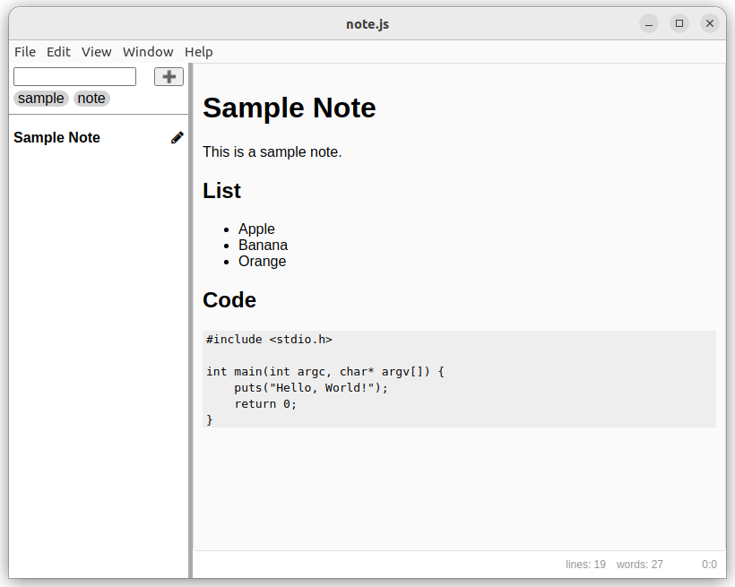
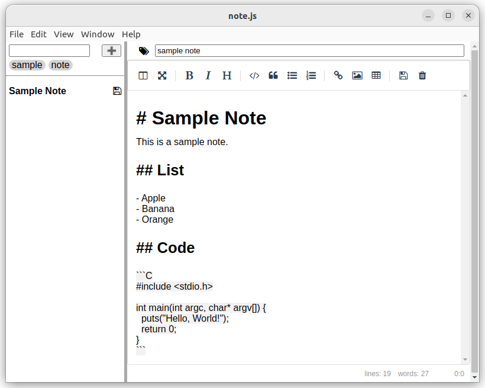

# note.js

[note.js](https://github.com/falk-werner/note.js) is yet another note taking app.  
It is based on [electron](https://www.electronjs.org/) in order to support a variety of platforms. It is also conforming to [note.spec v1](https://github.com/falk-werner/note.spec/tree/v1) storage format, which allows storing notes in a `Git` repository and edit them with other tools conforming to the specification.

## View Mode



In `view mode` you can browse, filter an view existing notes.

## Edit Mode



In `edit mode` you can create new notes or edit existing ones.  
To enter `edit mode` select an existing note in `view mode` and select the
`pencil` symbol.

## Features

- :white_check_mark: take notes using markdown
- :white_check_mark: filter existing notes
- :white_check_mark: rename existing notes
- :white_check_mark: remove existing notes
- :white_check_mark: storage conforming to [note.spec v1](https://github.com/falk-werner/note.spec/tree/v1)
- :construction: insert screenshots
- :construction: customize view using CSS

## Build and Run

```
npm install
npm run start
```

## Dependencies

- [npm](https://www.npmjs.com/)
- [electron](https://www.electronjs.org/)
- [Electron Forge](https://www.electronforge.io/)
- [yaml](https://eemeli.org/yaml/#yaml)
- [fontawesome](https://fontawesome.com/)
- [Marked](https://marked.js.org/)
- [SimpleMDE](https://simplemde.com/)
